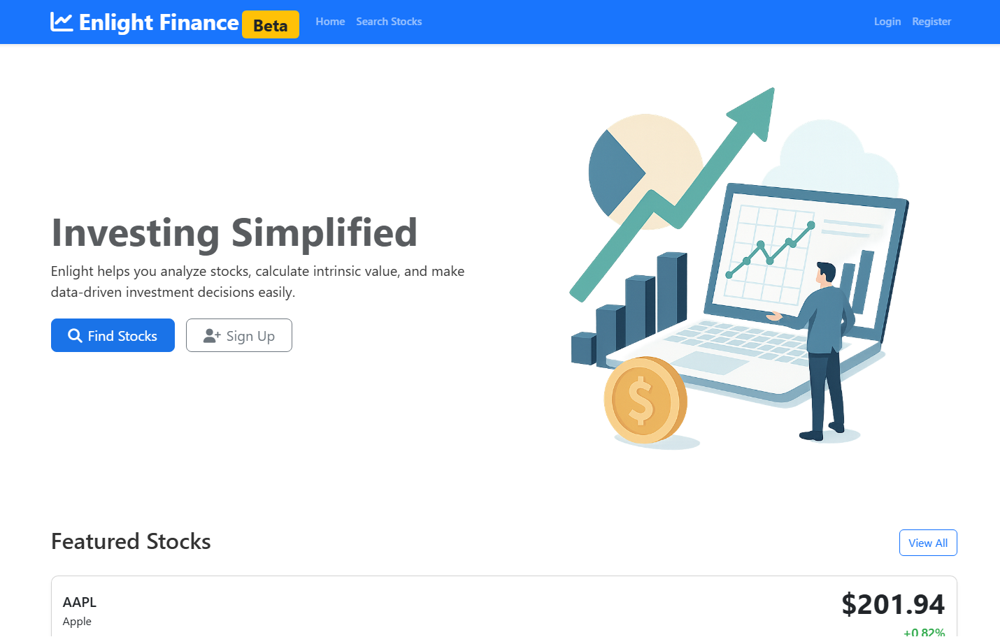

# Project Enlight – Financial Stock Analysis Platform

**Live Demo:** [https://app.enlitix.xyz](https://app.enlitix.xyz)  
**Tech Stack:** Python, Django, PostgreSQL, REST API, Celery, Redis, Docker

## Description
Enlight is a free full-stack financial analysis web application that enables users to calculate intrinsic stock values using multiple valuation models and live market data.

## Features
- Real-time API integration with fallback logic
- Celery + Redis background tasks for alerts and price monitoring
- JSON endpoints for AJAX-fed dashboards
- Dockerized deployment with automated update script
- PostgreSQL backend managed via Django ORM

## Screenshots

## Deployment
- Docker Compose 

## Source Code
Private repo – available upon request
